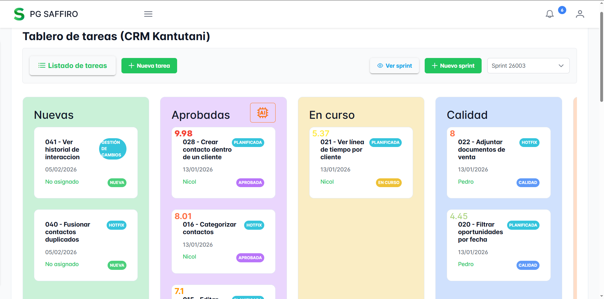

# pg-saffiro frontend

### Video Demo: [Project Software Management](https://youtu.be/vkgX7ywMP0o)


This project is part of the **pg-saffiro** project, which also includes the following repositories (Este proyecto forma parte del proyecto pg-saffiro, el cual incluye además los siguientes repositorios):
- [Saffiro-backend](https://github.com/AlfreGonzales/pg-saffiro-backend)
- [Saffiro-backend-ai](https://github.com/AlfreGonzales/pg-saffiro-backend-ai)

### Languages (Idiomas)
- [English](#english)
- [Spanish](#spanish)

---

<a name="english"></a>

This repository contains the frontend application developed with **Angular**, designed to consume the API of the Scrum-based project management system. The application offers a modern and intuitive interface that allows users to authenticate, manage projects, sprints, and tasks, view dashboards, and receive real-time notifications.

## 🚀 Key features

- Connection to the following two APIs:
  - [pg-saffiro backend](https://github.com/AlfreGonzales/pg-saffiro-backend)
  - [pg-saffiro backend-ai](https://github.com/AlfreGonzales/pg-saffiro-backend-ai)
- Authentication via **JWT**
- Dynamic **role and permission** management
- **User** management
- **Access log** recording
- **Development team** management
- **Company** management
- **Project** board for general monitoring
- **Task** board by **sprints**, aligned with the Scrum methodology
- **Real-time notifications** via Firebase
- **Report** generation and export
- **Dashboard** visualization

## 🛠️ Tools used

- **Angular** for project development
- **PrimeNG** as a UI component library
- **Firebase** for real-time notifications
- **ChartJS** for dashboard visualization
- **jsPDF** for exporting generated reports

## ▶️ How to execute the project

```bash
npm install
ng serve
```

Once you have executed the above commands, go to the following link: <http://localhost:4200/>

## 📄 License

[MIT License](LICENSE)

---

<a name="spanish"></a>

Este repositorio contiene la aplicación frontend desarrollada con **Angular**, diseñada para consumir la API del sistema de gestión de proyectos basada en Scrum. La aplicación ofrece una interfaz moderna e intuitiva que permite a los usuarios autenticarse, gestionar proyectos, sprints y tareas, visualizar dashboards y recibir notificaciones en tiempo real.

## 🚀 Funcionalidades principales

- Conexion a las dos siguientes APIs:
  - [pg-saffiro backend](https://github.com/AlfreGonzales/pg-saffiro-backend)
  - [pg-saffiro backend-ai](https://github.com/AlfreGonzales/pg-saffiro-backend-ai)
- Autenticación mediante **JWT**
- Gestión dinámica de **roles y permisos**
- Administración de **usuarios**
- Registro de **logs de acceso**
- Gestión de **equipos de desarrollo**
- Gestión de **empresas**
- Tablero de **proyectos** para el seguimiento general
- Tablero de **tareas** por **sprints**, alineado con la metodología Scrum
- **Notificaciones en tiempo** real mediante Firebase
- Generación y exportación de **reportes**
- Visualización de **dashboards**

## 🛠️ Herramientas utilizadas

- **Angular** para el desarrollo del proyecto
- **PrimeNG** como biblioteca de componentes UI
- **Firebase** para las notificaciones en tiempo real
- **ChartJS** para la visualizacion de los dashboards
- **jsPDF** para la exportación de reportes generados

## ▶️ Cómo ejecutar el proyecto

```bash
npm install
ng serve
```

Una vez ejecutados los comandos anteriores, dirigirse al siguiente enlace:
<http://localhost:4200/>

## 📄 Licencia

[Licencia del MIT](LICENSE)
